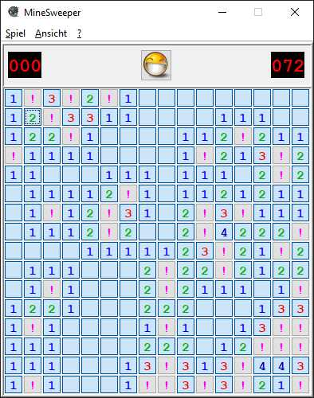

# MineSweeper (Windows-XP-Klon)

Dieses Projekt führte ich (unter anderen) neben meinem Bachelor-Studium. Dabei nutzte ich noch kein VCS (Schande über mich!). Die letzten Dateiänderungen waren laut Explorer im Juli 2012. Da der Quelltext jedoch Java-6-kompatibel ist und ich ein “Early Adopter” von Java 7 war – welches bereits ein Jahr zuvor veröffentlicht wurde – nehme ich an, dass das Projekt auch mindestens ein Jahr älter ist.

Das Ziel war es, vom “Look and Feel” möglichst nah an das Original von Windows XP zu kommen. Im Großen und Ganzen bin ich mit dem Ergebnis zufrieden, auch wenn meine Version etwas moderner geworden ist. 😏

Meine damalige (hochprofessionelle) To-do-Liste (und `// TODO`s im Code) habe ich unverschönt übernommen. Vielleicht haben irgendwann alle Punkte ein „+“ vorn dran? 😉

PS: Die `main`-Methode befindet sich in [`mine.MineFrame`](./src/mine/MineFrame.java).
